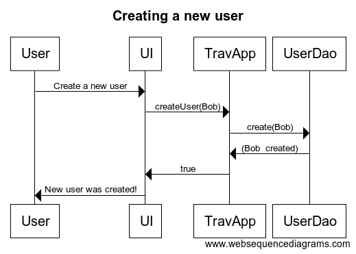
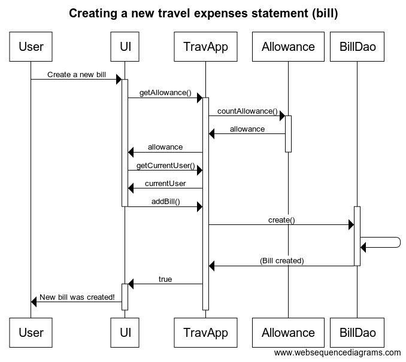

## Arkkitehtuurikuvaus

### Rakenne

Ohjelman rakenne on kolmitasoinen. Luokat on jaoteltu kolmeen 
pakkaukseen: 

* travelexpenses.ui sisältää graafisen käyttöliittymän (JavaFX)
* travelexpenses.domain sisältää sovelluslogiikan sekä käyttäjää, laskua
ja päivärahaa kuvaavat luokat
* travelexpenses.dao sisältää tietokannan käsittelyyn tarvittavat luokat

Pakkausrakenteen kuvaus:

### Käyttöliittymä

Käyttöliittymä (travelexpenses.ui.GraphicalUI) sisältää neljä näkymää: 

* kirjautuminen
* uuden käyttäjän luominen
* uuden matkalaskun luominen
* lopetusnäkymä  

### Sovelluslogiikka

Sovelluslogiikka on toteutettu luokassa travelexpenses.domain.TravelExpensesApp. 
Graafisessa käyttöliittymässä luodaan tästä luokasta olio, jolle injektoidaan riippuvuudet 
UserDao- ja BillDao -rajapinnat toteuttaviin luokkiin DatabaseUserDao ja DatabaseBillDao. 
Näiden luokkien kautta käsitellään tietokantaan tallennettavaa ja siellä olevaa tietoa.

Uuden käyttäjän luominen on kuvattu seuraavassa kaaviossa:

Uuden matkalaskun luominen on kuvattu allaolevassa kaaviossa:

### Tiedon pysyväistallennus

Sovellus käyttää travelexpenses.db-nimistä sqlite-tietokantaa. Tietokannan
rakenne on seuraavanlainen:

    User 	id integer PRIMARY KEY AUTOINCREMENT
      	 surname varchar(20) 
		forename varchar(15) 
		username varchar(15)

		| 1
		|
		|
		|
	      * |

    Bill 	id integer PRIMARY KEY AUTOINCREMENT
  		destination varchar(50) 
		begindate date 
		enddate date 
		expense1 float 
		expense2 float
		expense3 float 
		allowance float 
		user_id integer 
		FOREIGN KEY (user_id) REFERENCES User(id)

Tietokanta alustuu kutsumalla luokan TravelExpensesApp-konstruktorissa
saman luokan createDatabase()-metodia. Kun ohjelma on ajettu ensimmäisen
kerran, tämä metodikutsu pitää poistaa tai poiskommentoida. 

