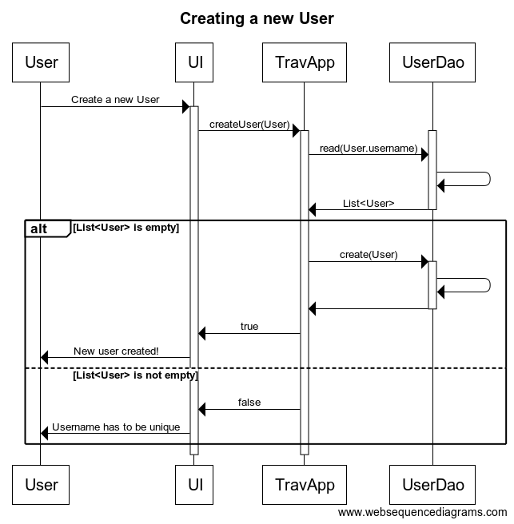

## Arkkitehtuurikuvaus

### Rakenne

Ohjelman rakenne on kolmitasoinen. Luokat on jaoteltu kolmeen pakkaukseen: 

* travelexpenses.ui sisältää JavaFX-kirjaston avulla toteutetun graafisen käyttöliittymän (TravelExpensesApp)
* travelexpenses.domain sisältää sovelluslogiikan sekä käyttäjää (User), laskua (Bill)
ja päivärahaa (Allowance) kuvaavat luokat
* travelexpenses.dao sisältää tietokannan käsittelyyn tarvittavat rajapinnat (UserDao ja BillDao) 
ja luokat (DatabaseUserDao ja DatabaseBillDao).

Pakkausrakenteen kuvaus:

### Käyttöliittymä

Käyttöliittymä on toteutettu luokassa travelexpenses.ui.GraphicalUI ja se sisältää viisi näkymää: 

* kysymys tietokannan alustamisesta
* kirjautuminen
* uuden käyttäjän luominen
* uuden matkalaskun luominen
* lopetusnäkymä  

Kukin näkymä on toteutettu omana Scene-olionaan. Käyttöliittymä on pyritty eristämään sovelluslogiikasta.

### Sovelluslogiikka

Sovelluslogiikka on toteutettu luokassa travelexpenses.domain.TravelExpensesApp. 
Graafisessa käyttöliittymässä luodaan tästä luokasta oli, jolle injektoidaan riippuvuudet 
UserDao- ja BillDao -rajapinnat toteuttaviin luokkiin DatabaseUserDao ja DatabaseBillDao. 
Näiden luokkien kautta käsitellään tietokantaan tallennettavaa ja siellä olevaa tietoa.

Sovelluslogiikassa näitä tietokannankäsittelyluokkia (ja tietokannan tauluja, ks. alla) vastaavat
luokat User ja Bill. Luokkien välillä ei ole riippuvuutta ohjelman tasolla, vaan niitä samoin kuin
kolmatta, päivärahaa kuvaavaa luokka Allowance käytetään sovelluslogiikan kautta.

Sovelluslogiikan tärkeimmät metodit ovat:

* boolean login (username)
* boolean createUser (User user)
* boolean addBill (Bill bill)

Sovelluslogiikkaluokassa suoritetaan myös päivämääräsyötteiden muodon tarkastus ja konvertointi 
LocalDate-muotoisiksi:

* LocalDate convertDate (String date)
* boolean checkDate (String date)
* boolean checkBeginDateIsNotAfterEndDate(String beginDate, String endDate)

Päivämääräsyötteiden tarkistus tapahtuu Count Allowance -nappia painamalla, jolloin
myös hyväksytyt päivämäärät tallentuvat luokan oliomuuttujiksi, jotta niitä voidaan käyttää
myös varsinaisessa laskun luomisessa.

### Tiedon pysyväistallennus

Sovellus käyttää travelexpenses.db-nimistä sqlite-tietokantaa. Tietokannan
rakenne on kuvattu seuraavassa kaaviossa.

Käynnistyessään ohjelma kysyy käyttäjältä, alustetaanko tai luodaanko
tietokanta. Jos käyttäjä valitsee "Yes", kutsutaan sovelluslogiikan metodia
createDatabase()-metodia, joka poistaa mahdollisesti olemassaolevat taulut
ja luo taulut uudestaan.

### Päätoiminnallisuudet

Allaolevissa kaavioissa on kuvattu tärkeimpien metodien toiminta.

#### Uuden käyttäjän luominen:

Käyttöliittymä kutsuu sovelluslogiikan metodia createUser, joka kutsuu ensin UserDaon metodia read,
parametrina käyttäjän syöttämä käyttäjänimi. UserDao palauttaa SQL-kyselyn tuloksen listana. Jos lista
on tyhjä, createUser kutsuu UserDaon metodia create ja tämän jälkeen palauttaa true käyttöliittymään, 
joka ilmoittaa onnistuneesta rekisteröitymisestä käyttäjälle. Jos lista ei ole tyhjä, eli tietokannassa
on jo kyseinen käyttäjänimi, createUser palauttaa false ja käyttöliittymä ilmoittaa käyttäjälle, että
käyttäjänimi on jo käytössä (Username has to be unique).

#### Sisäänkirjautuminen:

Käyttäjän kirjautuessa sisään, käyttöliittymän kutsuu sovelluslogiikan metodia login, joka kutsuu edelleen
UserDaon metodia read, parametrina käyttäjän käyttäjänimi. Tämä metodi palauttaa listan hakuehdon täyttävistä
käyttäjistä (User), ja sovelluslogiikka tarkistaa, onko koko yksi. Mikäli on, login-metodi asettaa käyttäjän
currentUser-oliomuuttujan arvoksi ja palauttaa true käyttöliittymälle, joka avaa ExpensesScene-näkymän 
käyttäjälle.
 
#### Päivärahan laskeminen:

Käyttäjän painaessa käyttöliittymässä nappia "Count allowance", käyttöliittymä kutsuu ensin 
sovelluslogiikan metodeja checkDate ja checkBeginDateIsNotAfterEndDate. Metodi checkDate tarkistaa, 
että päivämäärä on syötetty oikeassa muodossa, että se on mahdollinen päivämäärä ja että matkan 
alkupäivämäärä ei ole loppupäivämäärän jälkeen. Jos nämä tarkistukset menevät läpi, käyttöliittymä
kutsuu sovelluslogiikan metodia convertDate, joka muuntaa päivämäärät LocalDate-muotoisiksi, 
asettaa nämä käyttöliittymän oliomuuttujien arvoiksi ja kutsuu sovelluslogiikan metodia getAllowance
parametreinaan päivämäärät sekä abroad-checkboxin arvo (true jos matkakohde ulkomailla). 
Sovelluslogiikka palauttaa päivärahan arvon, jonka käyttöliittymä tallettaa oliomuuttujan arvoksi.

#### Uuden matkalaskun luominen:

Kun käyttöliittymällä on tiedossa päivämäärät ja päivärahan määrä, se pytää sovelluslogiikalta tiedon kirjautuneesta
käyttäjästä (getCurrentUser). Näillä tiedoilla käyttöliittymä kutsuu sovelluslogiikan metodia addBill, joka
kutsuu BillDaon metodia create. Tämän jälkeen sovelluslogiikka tiedottaa käyttöliittymää, joka 
avaa lougout-näkymän.

### Heikkoudet

Sovelluslogiikan eriyttäminen käyttöliittymästä ei täysin toteudu ohjelman nykyisessä versiossa. 
Tämä johtuu tavasta, jolla päiväraha lasketaan. Päivämäärätiedot luetaan käyttäjältä yhdessä kohdassa, mutta niitä tarvitaan
kahdessa kohdassa. Päivämäärät ja niiden sekä matkakohteen sijainnin perusteella laskettu päiväraha
ovat nyt oliomuuttujina käyttöliittymäluokassa, mikä ei ole optimaalista. Päivärahan laskeminen olisi
paras toteuttaa sovelluslogiikan kautta.

Virheimoitukset eivät ole kaikkialla kuvaavia, esimerkiksi päivämäärien tarkistuksessa ei
kerrota mikä niissä on vikana.

Lisäksi käyttöliittymän rakenne on nyt yhdessä pitkässä start-metodissa. Se olisi pitänyt jakaa
useampaan luokkaan, jotka olisivat huolehtineet eri näkymistä.

Jos tietokantaa ei ole olemassa mutta käyttäjä valitsee ettei halua luoda sitä, sovellus kaatuu.

SQL-Exceptionit käsitellään nyt pääasiassa sovelluslogiikassa.

 

