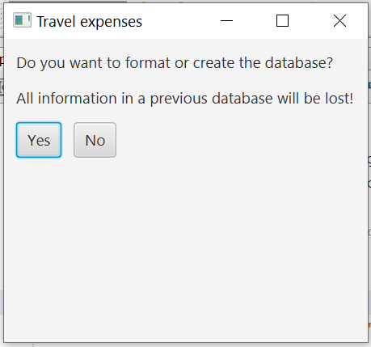
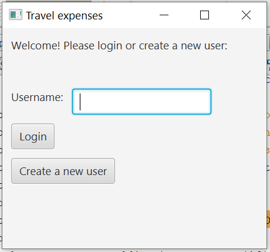

## Käyttöohje

### Aloitus
Sovellus käynnistyy näkymään, jossa käyttäjä valitsee, haluaako hän alustaa 
tietokannan vai ei. 

### Kirjautuminen

Seuraavaksi avautuu kirjautumisnäkymä. Käyttäjällä on mahdollisuus
joko luoda itselleen käyttäjätunnus, tai jos jos hänelle jo on sellainen,
kirjautua sisään sovellukseen.

### Uuden käyttäjän luominen
Jos käyttäjä on uusi, hän siis valitsee napin ´Create a new user´. Avautuu
uusi ikkuna, johon käyttäjä syöttää valitsemansa käyttäjätunnuksen
sekä oman suku- ja etunimensä. 

Painettuaan ´Create´ nappia käyttäjälle avautuu uudestaan
sisäänkirjautumisnäkymä, jossa ilmoitetaan käyttäjäntunnuksen luomisen
onnistumisesta. 

Käyttäjätunnuksen tulee olla uniikki, joten jos käyttäjä syöttää jo käytössä
olevan tunnuksen, ohjelma ilmoittaa, että tunnus on jo käytössä:

### Sisäänkirjautuminen
Kirjautuakseen sisään käyttäjän tulee kirjoittaa käyttäjänimensä kenttään
´username´. Jos kirjautuminen ei onnistu, sovellus ilmoittaa tästä: "Username was not found". 

Jos kirjautuminen onnistuu, avautuu seuraavaksi näkymä, johon täytetään matkalaskussa tarvittavat 
tiedot. 

### Matkalaskun tietojen syöttäminen
* Destination: paikkakunta, johon matka (pääasiallisesti) suuntautui
* Abroad-valintaruutu: onko matkakohde ulkomailla
* Start date: päivämäärä, jolloin matka alkoi (esim. muodossa 2020-01-01)
* End date: päivämäärä, jolloin matka päättyi (esim. muodossa 2020-01-03)
* Count allowance: napista painamalla sovellus laskee päivärahan määrän ja ilmoittaa sen
* Expenses: alasvetovalikosta valitaan syötettävän kulun tyyppi (Flights, Hotel, Other)
* Create a new travel expenses statement: napista painamalla matkalaskun tiedot
 tallennetaan tietokantaan sisäänkirjautunee[]n käyttäjän tiedoilla

Päivärahan laskeminen tarkistaa samalla päivämääräsyötteet. Jos ne eivät kelpaa,
sovellus ilmoittaa tästä ja kehottaa yrittämään uudestaan.

### Lopetus ja uloskirjautuminen

Kun lasku on syötetty, avautuu lopetusnäkymä, jossa ilmoitetaan, että matkalaskun 
tallennus onnistui ja pyydetään käyttäjää kirjautumaan ulos sovelluksesta.
Näkymään ilmestyy vielä teksti, että käyttäjä voi sulkea ikkunan.
 