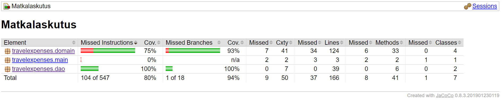

## Testausdokumentti

Sovellusta on testattu JUnit-kirjaston avulla laadituin automaattisesti ajettavin yksikkö- ja 
integraatiotestein sekä manuaalisesti ohjelmaa ajamalla.

### Yksikkö- ja integraatiotestit

Integraatiotestejä on tehty TravelExpensesApp-luokalle. Nämä testit testaavat 
sovelluslogiikan ja muiden luokkien yhteistoimintaa (User, Bill, Allowance ja Dao-luokat).

Yksikkötestejä on lisäksi kirjoitettu muutamille luokkien Bill ja Allowance metodeille. 

Dao-luokkia käyttävien testien kautta testatuksi tulevat myös tietokantaan tehtävät 
SQL-komennot ja kyselyt. Testit käyttävät samaa tietokantaa kuin sovellus, mutta poistavat 
tietokantaan tekemänsä muutokset.

### Testauskattavuus

Testien rivikattavuus on käyttöliittymä poisluettuna 80% ja haaraumakattavuus 94%.

Testaamatta jäävät tietokannan luova metodi sovelluslogiikassa sekä SQLExceptionin kiinniottavat 
haarat tietokantaa käyttävissä metodeissa.

### Järjestelmätestaus

Ohjelmaa on testattu manuaalisesti erilaisilla syötteillä. 

## Asennus- ja konfigurointi

Sovellusta on käytetty ja testattu sekä Windows10 että Linux ympäristöissä.

Sovellusta on testattu sekä tilanteissa, joissa tietokantaa on olemassa että
tilanteissa, joissa sitä ei ole ja se luodaan ohjelman alussa.

## Toiminnallisuudet

Kaikki [määrittelydokumentin](https://github.com/AgdaHTH/matkalasku/blob/master/dokumentaatio/vaatimusmaarittely.md) 
kuvailemat toiminnallisuudet on kokeiltu ohjelmassa.

Kattavimmin on tarkistettu päivämääräsyötteitä ja niiden oikeellisuutta, joskin niissäkin on vielä
parannettavaa. Esimerkiksi matkan vuosi ei saa olla myöhempi kuin kuluva vuosi, mutta 
kuukauden ja päivän kohdalla tämä testaus on vielä tekemättä.

Virheellisiä, lähinnä liian lyhyitä syötteitä tarkastetaan myös muissa kohdissa.

